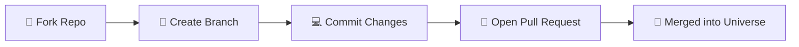

<div align="center">

  <!-- Header Banner -->
  

  <br/>

  <!-- Dynamic Typing Tagline -->
  <a href="https://codeverseorg.space">
    
  </a>

  <br/><br/>

  <!-- Primary Action Badges -->
  <a href="https://codeverseorg.space" target="_blank">
    
  </a>
  &nbsp;
  <a href="https://code-verse-terminal.vercel.app" target="_blank">
    
  </a>
  &nbsp;
  <a href="mailto:jogdandasmit@gmail.com">
    
  </a>
  &nbsp;
  <a href="https://github.com/CodeVerseOrg">
    
  </a>

  <br/><br/>

  <!-- Quick Info Pills -->
  
  
  
  

</div>

---

## 🌌 About CodeVerse

**CodeVerseOrg** is an open-source innovation collective where curiosity meets practical engineering. We build high-utility developer tools, modern web applications, media engines, and learning hubs — designed to solve real-world problems and help developers level up.

<table width="100%">
  <tr>
    <td width="33%" align="center">
      <h3>🚀 Build</h3>
      <p>Architecting modular open-source software, scalable web platforms, and community-driven developer utilities.</p>
    </td>
    <td width="33%" align="center">
      <h3>🤝 Collaborate</h3>
      <p>Providing a welcoming space where beginners find mentorship and experienced developers ship impactful code.</p>
    </td>
    <td width="33%" align="center">
      <h3>📚 Learn</h3>
      <p>Curating structured roadmaps, coding resources, and open tooling to accelerate everyone's engineering journey.</p>
    </td>
  </tr>
</table>

---

## 🪐 Flagship Ecosystem & Projects

A curated look at active builds across our universe:

| Project | Description | Tech Stack | Quick Links |
|:---|:---|:---:|:---:|
| 💻 **[CodeVerse-Terminal](https://github.com/CodeVerseOrg/CodeVerse-Terminal)** | Interactive in-browser Unix-like terminal environment with custom commands, themes, and org navigation | `JavaScript` `Vercel` `CSS3` | [](https://code-verse-terminal.vercel.app) [](https://github.com/CodeVerseOrg/CodeVerse-Terminal) |
| 🎬 **[ShadowPlex 2.0](https://github.com/CodeVerseOrg/ShadowPlex2.0)** | Next-gen streaming and media exploration web platform with responsive catalogs and high performance | `TypeScript` `React` `Next.js` | [](https://github.com/CodeVerseOrg/ShadowPlex2.0) |
| ✂️ **[ClipForge](https://github.com/CodeVerseOrg/ClipForge)** | High-speed web video clipping, generation, and media processing application | `TypeScript` `React` `Tailwind` | [](https://github.com/CodeVerseOrg/ClipForge) |
| 📖 **[AniDex-Reader](https://github.com/CodeVerseOrg/AniDex-Reader)** | Clean, lightweight digital comic and manga reader interface optimized for readability across devices | `TypeScript` `React` `PWA` | [](https://github.com/CodeVerseOrg/AniDex-Reader) |
| ⚡ **[anigo-anime-api](https://github.com/CodeVerseOrg/anigo-anime-api)** | High-throughput REST scraping API providing streaming endpoints, search, and rich metadata | `Node.js` `Express` `Vercel` | [](https://github.com/CodeVerseOrg/anigo-anime-api) |
| 📚 **[awesome-dev-resources](https://github.com/CodeVerseOrg/awesome-dev-resources)** | Exhaustive directory of roadmaps, free APIs, developer cheatsheets, and learning paths | `Markdown` `Curated` | [](https://github.com/CodeVerseOrg/awesome-dev-resources) |
| 🐍 **[codeverse-projects](https://github.com/CodeVerseOrg/codeverse-projects)** | Collection of automation scripts, developer utilities, and community Python projects | `Python` `Open Source` | [](https://github.com/CodeVerseOrg/codeverse-projects) |

---

## 🛠️ Tech Stack & Tooling

<div align="center">

#### Frontend & UI


#### Backend & APIs


#### Infrastructure & Tools


</div>

---

## 🤝 How to Contribute

We actively welcome contributions of every size — from fixing a typo to shipping a brand new project!



### Quick Workflow
1. **Fork the Repository** — Head to the project repository you want to work on and click **Fork**.
2. **Clone & Branch** — Set up locally and create an isolated branch:
   ```bash
   git clone https://github.com/<your-username>/<repo-name>.git
   cd <repo-name>
   git checkout -b feat/your-feature-name
   ```
3. **Commit with Precision** — Follow clean commit conventions:
   ```bash
   git commit -m "feat: add responsive navigation bar"
   ```
4. **Push & Open a PR** — Push to your branch and open a PR with a clear summary of your changes.

> 💡 **New to Open Source?** Look for issues labeled [`good first issue`](https://github.com/search?q=org%3ACodeVerseOrg+label%3A%22good+first+issue%22&type=issues) across our repositories — they're hand-picked for newcomers!

---

## 📊 Community & Metrics

<div align="center">
  
  &nbsp;
  
  &nbsp;
  
  &nbsp;
  
</div>

---

## 🪐 Connect With Us

Whether you want to collaborate, suggest an idea, or just say hi — we'd love to connect:

- 🌐 **Official Website:** [codeverseorg.space](https://codeverseorg.space)
- 💻 **Interactive Terminal:** [code-verse-terminal.vercel.app](https://code-verse-terminal.vercel.app)
- 🐙 **GitHub Organization:** [@CodeVerseOrg](https://github.com/CodeVerseOrg)
- 👤 **Founder & Maintainer:** Asmit Jogdand ([@SmitroniX](https://github.com/SmitroniX))
- 📬 **Email Us:** [jogdandasmit@gmail.com](mailto:jogdandasmit@gmail.com)

---

<div align="center">

  <!-- Footer Banner -->
  

  <br/>

  <sub>✨ <i>"Exploring the universe of code, together."</i> • © **CodeVerseOrg**</sub>

</div>
